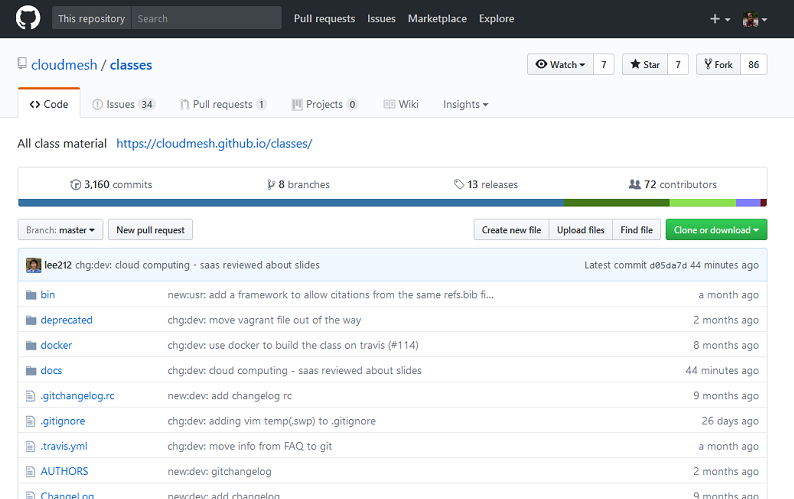

Creating a Pull Request in GitHub
=================================

Create a pull request to propose and collaborate on changes to a
repository. These changes are proposed in a branch, which ensures that
the master branch only contains finished and approved work. Pull
requests can only be opened if there are differences between your branch
and the upstream branch. You can specify which branch you'd like to
merge your changes into when you create your pull request.

This is an example of creating a pull request through the Github
repository.

Click on the ‘Fork’ button:

This is what you see after clicking on the ‘Fork’ button:

.. code:: python

    from IPython.display import Image
    Image(filename = "img1.png")

.. image:: output_3_0.png

   title

.. code:: python

    from IPython.display import Image
    Image(filename = "img2.png")

.. image:: output_6_0.png

Go to ‘edit’ button marked in the square:

.. code:: python

    from IPython.display import Image
    Image(filename = "img3.png")

.. image:: output_8_0.png

Then make whatever change you want to do. Write a commit message that
describes your changes. Click 'Commit changes' button.

